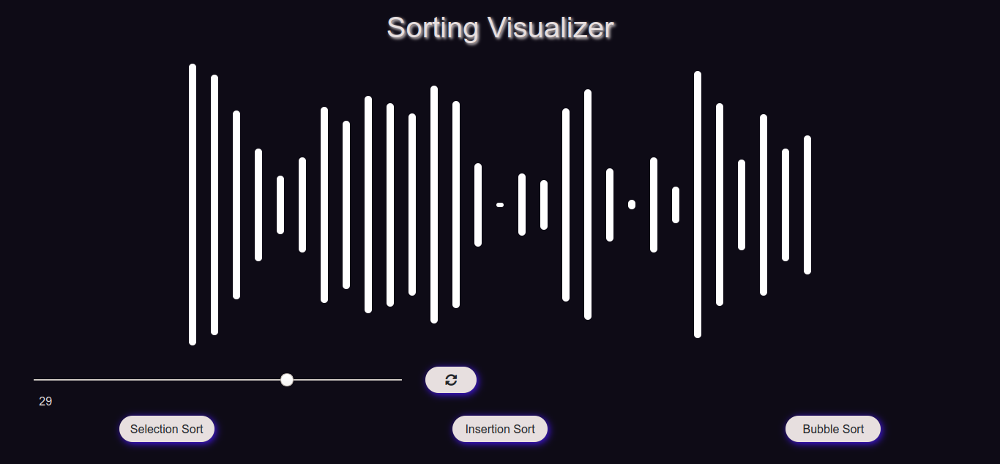

 

# Sorting Visualizer
Sorting Visualizer is an implementation of various sorting techniques using React & Redux. I have implemented Bubble Sort, Insertion Sort & Selection Sort. 
You can select the array size from the slider & a random array will be generated with that size. Now you'll just have to select the sorting technique which you want to use & now you can sit back and see the implementation in process. You'll also get to know the various steps in which the algorithm is working with the help of different colours.

 

### Project Link
https://vngarg.github.io/Sorting-Visualizer/

### Current Features
- [x] Optimized Algorithms.
- [x] Get to know about each step with the help of different colours used.
- [x] Visualize Bubble, Selection & Instertion Sort.
- [x] Attractive yet simple UI.

### Coming Soon
- [ ] Merge Sort
- [ ] Quick Sort
- [ ] Heap Sort
- [ ] Count Sort
- [ ] Sheel Sort